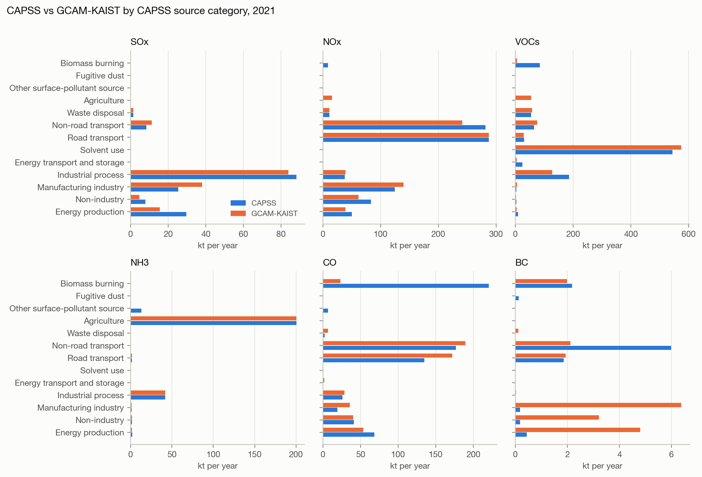
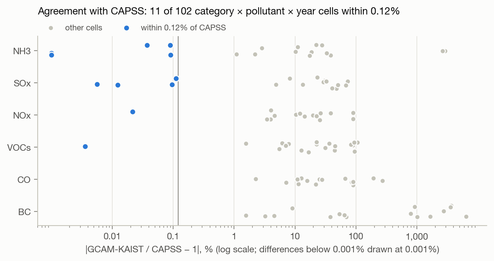
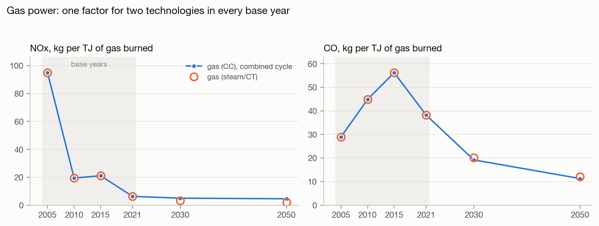
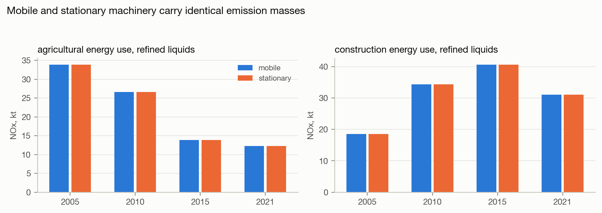
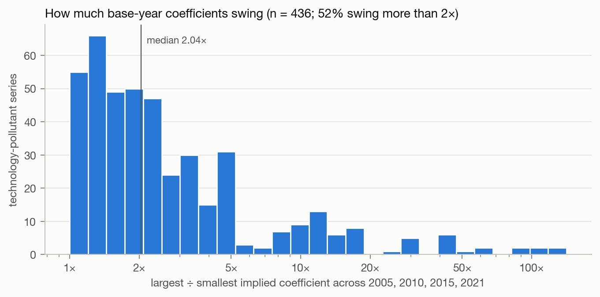
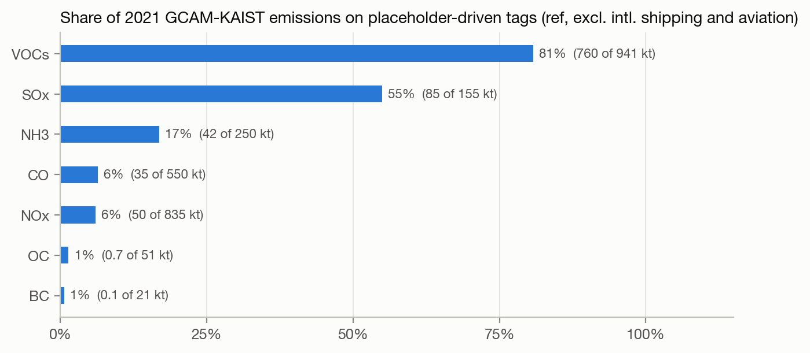
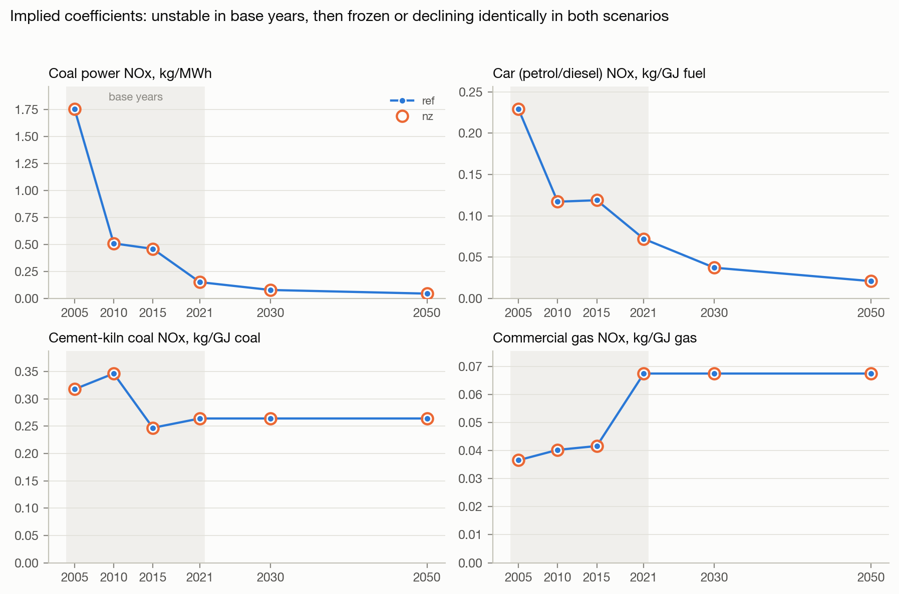
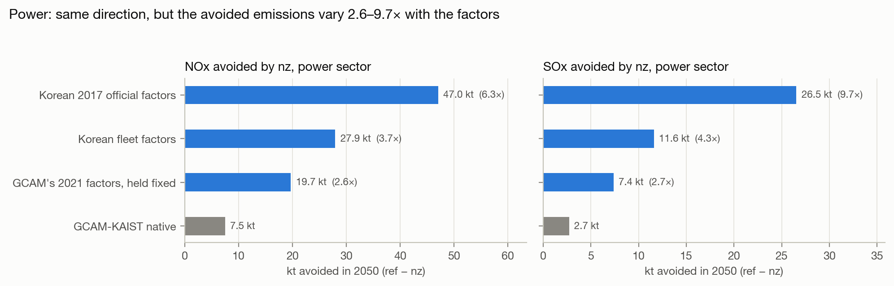
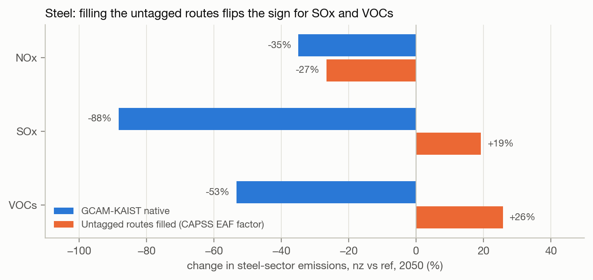
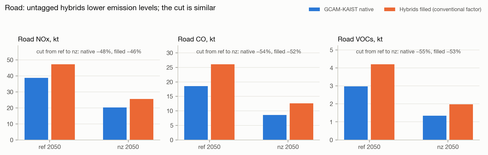

# Why GCAM's native non-CO2 emissions can't support the NZK health analysis

Status as of 2026-10-05. This document is the single source for the paper's Background section and the
PI presentation on this topic. It describes, step by step, how we tested GCAM-KAIST's native non-CO2
emissions, and why the project builds bottom-up emission factors instead.

It builds on the audit in [`gcam_kaist_nonco2_audit.md`](gcam_kaist_nonco2_audit.md) (cited below as
"audit §…"), which documents how GCAM-KAIST stores and reports non-CO2 emissions. Facts established
there are cited, not repeated.

**Framing.** Almost everything described here is GCAM's standard non-CO2 approach, which GCAM-KAIST
inherits from stock GCAM v9 (audit §B5.2). The critique is of that approach as applied to policy-driven
technology change in Korea, not of choices made by the KAIST team.

**Plain-English sections** are marked 🟢. Technical sections follow each one.

---

## 0. Summary 🟢

The question was whether we can take GCAM-KAIST's own non-CO2 emissions (NOx, SO2, VOCs, NH3, CO,
BC) and use them to estimate the air-quality and health effects of Korea's net-zero pathway.

We can't. The core reasons:

1. **GCAM-KAIST's close agreement with Korea's national inventory (CAPSS) is not evidence of
   accuracy.** The base-year numbers *are* inventory numbers: CAPSS totals passed through CEDS into
   GCAM's calibration. Comparing them with CAPSS compares CAPSS with itself.
2. **The emission factors are a by-product of that calibration, not measurements.** GCAM divides each
   inventory total by its own modelled activity. Different technologies inside the same total
   therefore get the same factor, and the factors swing from one base year to the next.
3. **After 2021 the factors don't respond to policy.** They stay frozen or follow a GDP-based curve
   that's the same in both scenarios. Technologies with no emissions tag count as zero, and the
   net-zero scenario shifts activity toward exactly those technologies.
4. **These limits change the policy answer.** Keeping GCAM-KAIST's activity and swapping only the
   emission factors, the projected net-zero change in steel SOx flips from −88% to +19%, and the
   power-sector NOx and SOx avoided varies 2.6–9.7×.

**What we do instead:** keep GCAM-KAIST's *activity*, and replace its *emission factors* with
bottom-up, technology-specific Korean factors, validated against CAPSS in the base years.

---

## 1. The question 🟢

The NZK health analysis needs emissions that respond to what a decarbonization pathway actually
changes: which fuels are burned, in which technologies, with what pollution controls. Those
emissions then go into InMAP and a health model.

GCAM-KAIST is the project's source of projected activity: how much electricity each power
technology generates, how much steel each production route makes, how many kilometres each vehicle
type drives, and so on. It also reports its own non-CO2 emissions. The obvious shortcut would be to
use those directly.

Our first comparison against CAPSS looked encouraging: some categories matched closely. So the
question became: **does that agreement mean GCAM-KAIST's native non-CO2 emissions can be trusted for
policy analysis?**

## 2. How GCAM represents non-CO2 emissions 🟢

A non-CO2 emission in GCAM exists only where the model attaches an emissions "tag" to a technology
(audit §A1). The output database stores just the emitted mass per year. The emission factor is not
stored; we compute it as mass ÷ activity.

The mass gets there in two phases (audit §A2):

- **Base years (up to 2021).** An inventory total is supplied, and GCAM divides it by its own
  activity to get the factor.
- **Future years.** That factor is carried forward, either frozen or reduced along a pre-set curve,
  and multiplied by the scenario's activity.

---

## 3. The investigation, step by step

Each step is laid out as: the question we asked, what we did, what we found, and a plain-English
takeaway.

### Step 1. Compare GCAM-KAIST with CAPSS by source category

**Question.** How close are GCAM-KAIST's base-year emissions to CAPSS?

**What we did.**
- Assigned each of 127 GCAM-KAIST emitting sectors to one of CAPSS's 13 first-level source categories
  (crosswalk: `src/gcam_emissions/reference/gcam_kaist_capss_category_crosswalk.csv`).
- Applied two finer overrides: residue-burning species → Biomass burning, and the `solvents`
  subsector → Solvent use.
- Excluded international aviation and shipping as bunker fuel.
- Compared the totals with CAPSS's published 2015 and 2021 category totals for the six pollutants both
  report (SOx, NOx, VOCs, NH3, CO, BC). GCAM reports no PM2.5 or PM10.

**What we found.** Agreement is very uneven (Figure 1).
- Some cells are nearly identical: agricultural NH3, road-transport NOx in 2021, industrial-process
  NH3, waste SOx.
- Others are far off:
  - **BC** is 9–65× higher than CAPSS in the stationary-combustion categories.
  - **Biomass-burning CO and VOCs** are only 6–11% of CAPSS.
  - **Energy transport and storage VOCs** (fuel storage and distribution) are only 12–18% of CAPSS.

*Figure 1. CAPSS vs GCAM-KAIST by CAPSS category, 2021. The 2015 version is
`figures/fig01_capss_vs_gcam_2015.png`.*

> 🟢 **Takeaway.** Some categories match almost perfectly and others are off by an order of magnitude.
> Before reading the good matches as "GCAM is accurate", we needed to know where GCAM's numbers come
> from.

### Step 2. Understand how GCAM stores and reports non-CO2

**Question.** Is there a GCAM output we're missing, such as a query for cement or refinery emissions?

**What we did.** Read the output database structure and GCAM's standard reporting queries (audit §B2,
§B3).

**What we found.**
- GCAM has no sector-specific non-CO2 queries. The standard queries return every tag that exists.
- A sector reports non-CO2 emissions if, and only if, its technologies carry tags.

> 🟢 **Takeaway.** If GCAM-KAIST reports nothing for an activity, it isn't a missing query. The
> model never attached emissions to that activity.

### Step 3. Check which activities carry emissions tags

**Question.** Does every emitting activity in GCAM-KAIST have tags?

**What we did.** Listed every technology with activity in either scenario up to 2050, and checked
which carry tags (audit §B4).

**What we found.**
- All operating fossil power plants are tagged.
- Several large activities are not:
  - the cement *process* (only kiln fuel is tagged);
  - oil refining (4.69 EJ of output in 2021);
  - chemical feedstocks and industrial cogeneration.
- Several technologies that grow in the net-zero scenario are also untagged: hybrid vehicles,
  hydrogen-based steel, and steel and cement with carbon capture.
- All of these gaps also exist in stock GCAM v9 (audit §B4).

> 🟢 **Takeaway.** Some real sources of air pollution are simply absent from GCAM, and the net-zero
> scenario moves activity toward technologies that the model treats as emission-free.

### Step 4. Trace where the base-year numbers come from

**Question.** Why do some CAPSS categories match so closely?

**What we did.**
- Compared GCAM-KAIST's base-year tags with stock GCAM v9's input files (audit §B5.2).
- Traced stock GCAM's calibration source through CEDS's documentation (audit §B5.3).
- Measured how closely each category × pollutant × year cell agrees with CAPSS (audit §B5.4).

**What we found.**
- GCAM-KAIST's base-year emissions are stock GCAM v9's: 2,244 of 2,251 values match within 0.1%.
- Stock GCAM calibrates to CEDS, and CEDS documents scaling its Korean estimates to NIER's national
  inventory, which is published as CAPSS.
- **11 of the 102 comparable cells agree with CAPSS to within 0.12%**, several to four or five
  significant figures. For example, agricultural NH3 is 200,384.0 t vs CAPSS 200,384 t in 2021
  (Figure 2).

*Figure 2. Relative difference from CAPSS for every comparable cell (log scale). The 11 blue cells
agree within 0.12%; the rest differ by 1% to over 1,000%.*

> 🟢 **Takeaway.** Agreement to five significant figures doesn't happen by independent estimation.
> These base-year numbers were built from the inventory itself, so their agreement with CAPSS is
> circular: it shows the calibration worked, not that GCAM represents emissions correctly.

### Step 5. Stress-test the category mapping

**Question.** Is the poor agreement elsewhere just a mapping problem? Would a better assignment of
GCAM sectors to CAPSS categories make everything line up?

**What we did.**
- Identified 15 groups of GCAM-KAIST rows whose CAPSS category is ambiguous. Examples: stationary
  construction machinery, residential wood burning, iron and steel, international shipping and
  aviation, and industrial oil use.
- Gave each group its 2–3 plausible categories, and evaluated all 49,152 combinations against CAPSS
  for 2015 and 2021.
- Scored each mapping by the share of CAPSS's emitted mass that ends up in the wrong category,
  averaged over the 12 year × pollutant combinations.

Script: `results/diagnostics/capss_calibration_test/mapping_search.py`.

**What we found.**

| Mapping | Share of CAPSS mass in the wrong category | Cells within 0.12% | Within 5% | Within 10% |
|---|---|---|---|---|
| Current crosswalk | 44.4% | 11 | 24 | 31 |
| Best of 49,152 | 40.9% | 12 | 29 | 41 |

*(out of 102 comparable cells)*

- No mapping comes close to reproducing CAPSS; the best removes only 3.5 percentage points of
  misallocation. The near-exact cells in Step 4 appear under the current crosswalk, with no search
  needed.
- The best mapping makes four changes:
  - residential traditional biomass → Biomass burning;
  - biodiesel refining → Manufacturing industry;
  - international aviation → Non-road transport;
  - `other industrial energy use / refined liquids` → Energy production.
- The last one is informative. It brings Energy production CO and NH3 within 2% of CAPSS. Together
  with GCAM's own CEDS sector map, it indicates that refinery fuel-combustion emissions sit inside
  GCAM's industrial energy use (audit §B5.5, an inference).

> 🟢 **Takeaway.** The mismatches are not a bookkeeping problem we can fix by relabelling. Agreement is
> excellent where a GCAM sector lines up one-to-one with a CAPSS category, and poor where it doesn't.
> That pattern is what calibration produces, not what physics produces.

*Caveat.* With 15 binary or ternary choices, some improvement is expected by chance. The search is used
only to show that remapping can't *create* agreement; the near-exact cells need no search.

### Step 6. Back-calculate the emission factors

**Question.** What emission factor does each GCAM-KAIST technology implicitly use, and does it reflect
the technology?

**What we did.** Divided each tag's emissions by the activity GCAM ties it to (fuel burned, or
output) for every base year (audit §B6.1).

**What we found.**

**(a) Different technologies share one factor.**
- Combined-cycle and steam/turbine gas plants have identical NOx and CO factors per unit of fuel in
  every base year from 2005 to 2021 (Figure 3).
- Mobile and stationary machinery carry exactly equal emission masses in every base year (Figure 4).
- Commercial heating, cooling and "other" uses of gas share one factor, and so do all ten household
  income groups (audit §B6.2).

*Figure 3. Implied NOx and CO factors per TJ of gas for the two gas-power technologies. They coincide
in every base year and diverge only after 2021.*

*Figure 4. NOx from refined-liquids machinery: mobile and stationary carry identical masses in every
base year, in both agriculture and construction. (Mining, not shown, behaves the same.)*

**(b) Factors swing between base years.** The typical technology-pollutant factor varies about 2×
across 2005–2021, and one in ten varies more than 11× (Figure 5). A real emission rate doesn't move
like that.

*Figure 5. Ratio of the largest to the smallest implied factor across 2005, 2010, 2015 and 2021, for
436 technology-pollutant series.*

**(c) Large shares of emissions are tied to no activity at all.** In 2021, 81% of GCAM-KAIST's
Korean VOCs and 55% of its SOx sit on tags driven by a fixed placeholder, not by any production
quantity (Figure 6; audit §B6.4). This excludes international shipping and aviation.

*Figure 6. Share of 2021 emissions on placeholder-driven tags (solvents, other industrial processes,
waste).*

> 🟢 **Takeaway.** GCAM's factors are what's left after dividing an inventory total among
> technologies. They can't tell a combined-cycle gas plant from an older one, or a tractor from a
> farm boiler. They jump around between years, and for most VOCs and SOx they aren't attached to
> anything that changes with production.

### Step 7. Follow the factors into the future

**Question.** How do the factors behave in the scenario years we actually need?

**What we did.** Compared each factor in 2050 with its 2021 value, and the `nz` value with the `ref`
value (audit §B6.5).

**What we found.**
- **After 2021, 46% of factors stay frozen and 52% decline along the pre-set curve.**
- **In 2050, 93% are identical in the reference and net-zero scenarios** (Figure 7).
- The net-zero scenario therefore changes emissions almost only through activity: how much of each
  technology runs. It does not change how clean each technology is.

*Figure 7. Four examples. The `nz` markers sit exactly on the `ref` line. Coal power and car factors
decline along the pre-set curve; cement-kiln coal and commercial gas factors stay frozen at their 2021
values.*

> 🟢 **Takeaway.** The model has no lever for pollution-control policy: scrubbers, emission standards,
> cleaner boilers. Any such improvement is assumed identically in both scenarios, so it can never
> show up as a benefit of the policy.

---

## 4. Does it change the policy answer? The policy experiment

### 4.1 What the experiment does 🟢

Emissions = **activity × emission factor**, technology by technology. GCAM-KAIST gives us both.

The experiment keeps **GCAM-KAIST's activity exactly as it is** in both scenarios (how much coal
power runs, how much steel each route makes, how far hybrid buses travel) and **swaps only the
emission factors**. Then it asks the policy question:

> *How much lower are 2050 emissions in the net-zero scenario than in the reference scenario?*

If GCAM's own factors and more realistic factors give about the same answer, GCAM's native emissions
would be good enough for comparing policies, even if their levels were off. If the answers differ, the
native emissions can't be used to judge the policy.

We ran it for three sectors, each testing a different weakness from Section 3:

- **Power** tests "one factor per fuel, on a curve shared by both scenarios" (Steps 6–7).
- **Steel** tests "untagged technologies count as zero" (Step 3).
- **Road transport** tests the same thing for hybrid vehicles (Step 3).

### 4.2 Design

| Sector | Variant | Emission factors used |
|---|---|---|
| Power | native | GCAM-KAIST's own emissions |
| | GCAM 2021, fixed | GCAM's own 2021 factor per MWh for each technology, held constant to 2050 |
| | Korean fleet | Korean factors per MWh × GCAM generation: coal 2022 fleet (NOx 0.102, SOx 0.110); gas 2017 official (NOx 0.171); oil 2015–17 (NOx 0.719, SOx 1.316) |
| | Korean 2017 | Same, but coal at the 2017 official national factor (NOx 0.291, SOx 0.258) |
| Steel | native | GCAM-KAIST's own emissions; hydrogen-based DRI and blast furnace with CCS count as zero |
| | filled | Hydrogen-based DRI at the CAPSS electric-arc-furnace process factor (NOx 0.2, SOx 0.35, VOCs 0.09 kg/t); blast furnace with CCS at GCAM's own blast-furnace factor |
| Road | native | GCAM-KAIST's own emissions; hybrids count as zero |
| | filled | Hybrids at the same vehicle type's conventional-fuel factor per unit of fuel |

Notes on the design:
- Biomass power stays at GCAM's native emissions in the Korean variants. The repo has no usable Korean
  power-plant biomass factor: biomass IGCC is an explicit gap, and the conventional-biomass factor
  comes from small boilers.
- The steel fill is a **lower bound**: hydrogen-based DRI also burns gas and oil (audit §B4), and that
  combustion isn't counted.

Script: `results/diagnostics/policy_experiment/policy_experiment.py`.

### 4.3 Results

**Power: same direction, very different size** (Figure 8). The net-zero scenario has almost no fossil
power left in 2050, so every variant shows a cut of about 99%. What differs is how much is *avoided*,
because that depends on how dirty the reference scenario's power is:

| 2050, power sector | NOx avoided (kt) | SOx avoided (kt) |
|---|---|---|
| GCAM-KAIST native | 7.5 | 2.7 |
| GCAM's 2021 factors, fixed | 19.7 (2.6×) | 7.4 (2.7×) |
| Korean fleet factors | 27.9 (3.7×) | 11.6 (4.3×) |
| Korean 2017 official factors | 47.0 (6.3×) | 26.5 (9.7×) |

Holding GCAM's *own* factors fixed already gives 2.6×. Most of the gap therefore comes from the
pre-set curve that shrinks the reference scenario's factors. The curve is an assumption shared by
both scenarios, not a policy outcome.

For context, in 2021 Korean fleet factors × GCAM generation give 1.4× GCAM's native power NOx and
1.7× its SOx.

*Figure 8. NOx and SOx avoided by the net-zero scenario in 2050, power sector, under each set of
factors.*

**Steel: the direction flips** (Figure 9).

| 2050, steel sector, nz vs ref | NOx | SOx | VOCs |
|---|---|---|---|
| GCAM-KAIST native | −35% | **−88%** | −53% |
| Untagged routes filled (lower bound) | −27% | **+19%** | **+26%** |

The 88% SOx cut comes from the net-zero scenario's steel moving onto routes with no tags (16.4 Mt
hydrogen-based DRI, 4.2 Mt blast furnace with CCS). Once their electric-arc-furnace process emissions
are counted, steel SOx and VOCs *rise* under net zero.

*Figure 9. Change in 2050 steel-sector emissions, net zero vs reference.*

**Road: modest** (Figure 10). Counting hybrids raises 2050 road emission levels in both scenarios:
- NOx: 22–26% higher;
- CO: 40–47% higher;
- VOCs: 41–48% higher.

The relative cut barely changes (NOx −48% native vs −46% filled).

*Figure 10. 2050 road emissions with and without hybrids counted.*

> 🟢 **Takeaway.** Using GCAM-KAIST's native emissions would get the *direction* wrong for steel, and
> the *size* of the power-sector benefit wrong by 2.6–9.7×. Road emission levels would be too low by a
> fifth to a third or more. Because the health benefit of a policy is computed from the emissions it
> avoids, these errors carry straight through to the health results.

### 4.4 Limits of the experiment

- **It is illustrative.** None of the Korean or CAPSS factors used are production-ready. The steel
  factor is from CAPSS VI and is flagged as superseded pending the CAPSS VII update. The power factors
  mix 2017 and 2022 evidence.
- **Gas power isn't resolved by technology.** The Korean gas factor is itself a fleet average, so this
  experiment can't separate combined-cycle from steam/turbine plants. The evidence for that lumping is
  GCAM's own identical factors (Step 6a).
- **Why there is no upper bound for steel.** Filling hydrogen-based DRI with GCAM's own `EAF with DRI`
  factor instead makes net-zero steel NOx *rise* 40%. That factor is itself the anomalous stock
  coefficient (11.66 kg NOx/t; audit §B6.2), so we don't use it as a bound.
- **Some weaknesses aren't tested.** Placeholder-driven sources (solvents, industrial processes) and
  refining are not part of the experiment, because they have no activity driver to apply a factor to.

---

## 5. What this means for using GCAM-KAIST 🟢

**Use GCAM-KAIST's activity; don't use its native non-CO2 emissions.** GCAM-KAIST remains the
project's source of projected activity. What it can't supply is emission factors that distinguish
technologies, respond to controls, or cover every source.

### 5.1 Limitations of GCAM's native non-CO2 approach, as inherited by GCAM-KAIST

| Limitation | Evidence |
|---|---|
| Base-year emissions are calibrated inventory totals, so agreement with CAPSS is circular | Step 4; audit §B5 |
| One factor shared by distinct technologies within an inventory total | Step 6a; audit §B6.2 |
| Factors swing between base years | Step 6b; audit §B6.3 |
| Large shares of VOCs and SOx tied to a placeholder, not to activity | Step 6c; audit §B6.4 |
| Future factors frozen or on a curve shared by both scenarios; no pollution-control lever | Step 7; audit §B6.5 |
| Untagged sources and technologies count as zero (cement process, refining, hybrids, hydrogen steel, CCS) | Step 3; audit §B4 |
| No primary PM2.5 or PM10 | audit §B2 |

### 5.2 The power sector: what is and isn't lumped

Power is the best-resolved part of GCAM-KAIST, so it needs a precise statement:

- **Each fuel has its own factor.** Coal, gas, oil and biomass power are separate, so a coal-to-gas
  switch does change GCAM's emissions in the right direction.
- **Lumping happens *within* a fuel.** Combined-cycle and steam/turbine gas plants share one factor
  per unit of fuel (Figure 3). The coal IGCC and coal CCS variants have no activity in these runs, and
  gas with CCS runs only at small scale in 2050 (`nz`).
- **How the base-year factors compare with Korean evidence** (`figures/data/table_power_factors.csv`;
  Korean values from `docs/gcam_kaist_ef_target_table.csv`, not production-ready):

| Technology, pollutant | GCAM-KAIST 2015 (kg/MWh) | GCAM-KAIST 2021 (kg/MWh) | Korean reference (kg/MWh) | Comparison |
|---|---|---|---|---|
| Coal, NOx | 0.458 | 0.150 | 0.291 (2017 official); 0.102 (2022 fleet) | Within about 1.6×, same downward trend |
| Coal, SOx | 0.267 | 0.071 | 0.258 (2017 official); 0.110 (2022 fleet) | Close in 2015; 2021 is 0.65× the 2022 fleet value |
| Gas combined cycle, NOx | 0.134 | 0.040 | 0.171 (2017 official fleet average) | 2015 close; 2021 4.3× lower |
| Gas steam/turbine, NOx | 0.201 | 0.060 | 0.171 (same fleet average) | 2015 close; 2021 2.9× lower |
| Oil, NOx | 0.509 | 0.320 | 0.711–0.727 (2015–17) | About 1.4× lower in 2015 |
| Oil, SOx | 0.520 | 0.374 | 1.264–1.367 (2015–17) | About 2.5× lower in the same years |

In short: **coal roughly tracks the Korean evidence; gas tracks in 2015 but not 2021; oil doesn't
track.** Even where a factor tracks, it is a fleet average. It carries no information about which
plants have which controls, and after 2021 it follows the shared curve rather than policy.

### 5.3 Beyond this project

Because these properties come from GCAM's standard non-CO2 approach, they apply to any study that uses
GCAM's native non-CO2 emissions to evaluate technology transitions, not only to GCAM-KAIST. Whether
the same lumping holds in GCAM-USA, which has its own US emission inputs, has not been checked here
and is the subject of a separate note.

---

## 6. Our approach: bottom-up emission factors 🟢

The project builds a non-power (and interim power) emission-factor inventory that pairs **GCAM-KAIST
activity** with **technology-specific Korean emission factors**. It keeps three legs separate:

- **Activity:** which GCAM path and unit gives the physical quantity, for example tonnes of clinker or
  vehicle-km.
- **Factor:** which CAPSS or Korean source supplies the emission factor for that quantity.
- **Spatial:** where the emissions are placed on the grid.

How it addresses each limitation:

| GCAM limitation | Bottom-up remedy |
|---|---|
| Circular agreement with CAPSS | Factors come from source-level evidence, not from dividing inventory totals. Agreement with CAPSS in the base years then becomes a genuine validation test. |
| Shared factors across technologies | One factor per technology and control configuration (for example combined-cycle vs steam/turbine; plants with and without flue-gas desulfurization). |
| Untagged sources count as zero | Every activity gets a factor or an explicit, recorded gap; a missing factor never becomes zero. |
| Placeholder drivers | Process emissions are tied to physical activity: clinker, crude throughput, solvent use. |
| No pollution-control lever | Factors can differ by scenario where a policy changes controls or standards. |
| No PM2.5 or PM10 | CAPSS factors include PM2.5, PM10 and TSP. |

This approach has its own costs:
- GCAM's units (EJ, Mt, passenger-km) must be converted to the factors' units (tonnes of clinker,
  vehicle-km, animal-years).
- Korean factors must be collected and reviewed.
- A spatial allocation must be built.

The inventory is a work in progress. Current status is tracked in [`roadmap.md`](roadmap.md), and the
method will be described fully once it is complete.

---

## 7. Caveats and open items

- **KAIST inputs.** GCAM-KAIST's input files were not examined. The provenance argument (Step 4) rests
  on its outputs matching stock GCAM v9. Requested from KAIST: the run configurations and emissions
  input files.
- **CEDS release.** The CEDS → CAPSS link rests on CEDS documentation and on the near-exact
  agreement. It has not been traced through the CEDS release that GCAM v9 uses.
- **Refinery emissions.** That they sit in `other industrial energy use / refined liquids` is an
  inference (Step 5; audit §B5.5).
- **Mapping search.** Choosing the best of 49,152 mappings flatters the fit; only the "remapping can't
  create agreement" conclusion is drawn from it.
- **Policy experiment.** Illustrative, with factors that are not production-ready (§4.4).
- **Region.** Only South Korea was examined.

## 8. Figures, tables and reproduction

All figures and tables are produced by one script, [`figures/make_figures.py`](figures/make_figures.py),
run from the repo root. Each figure's plotted numbers are saved in `figures/data/` (the table view).
The script reads local diagnostics under `results/` and `data/`, which are untracked, so it can only be
re-run where those files exist.

| Item | File | Data |
|---|---|---|
| Figure 1 | `figures/fig01_capss_vs_gcam_2021.png` (2015: `..._2015.png`) | `data/fig01_capss_vs_gcam_{2015,2021}.csv` |
| Figure 2 | `figures/fig02_capss_agreement.png` | `data/fig02_capss_agreement.csv` |
| Figure 3 | `figures/fig03_gas_cc_vs_steamct.png` | `data/fig03_gas_cc_vs_steamct.csv` |
| Figure 4 | `figures/fig04_mobile_vs_stationary.png` | `data/fig04_mobile_vs_stationary.csv` |
| Figure 5 | `figures/fig05_base_year_swing.png` | `data/fig05_base_year_swing.csv` |
| Figure 6 | `figures/fig06_placeholder_shares.png` | `data/fig06_placeholder_shares.csv` |
| Figure 7 | `figures/fig07_coefficient_trajectories.png` | `data/fig07_coefficient_trajectories.csv` |
| Figure 8 | `figures/fig08_policy_power.png` | `data/fig08_policy_power.csv` |
| Figure 9 | `figures/fig09_policy_steel.png` | `data/fig09_policy_steel.csv` |
| Figure 10 | `figures/fig10_policy_road.png` | `data/fig10_policy_road.csv` |
| Mapping-search table (Step 5) | | `data/table_mapping_search.csv` |
| Power-factor table (§5.2) | | `data/table_power_factors.csv` |

Upstream evidence scripts are listed in audit §B9. The experiment's script and outputs are in
`results/diagnostics/policy_experiment/`.
